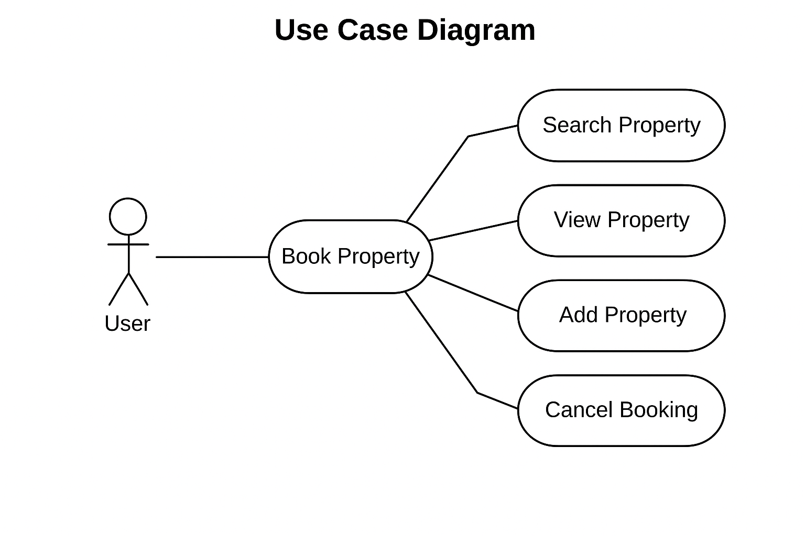

# Requirement Analysis in Software Development

## Introduction

This repository serves as a comprehensive guide to understanding and implementing Requirement Analysis in the software development lifecycle. It documents the essential processes, methodologies, and best practices for gathering, analyzing, and structuring requirements for software projects. Through the lens of a booking management system case study, we explore how proper requirement analysis establishes a solid foundation for successful project delivery.

## What is Requirement Analysis?

Requirement Analysis is a critical phase in the software development lifecycle (SDLC) that involves systematically identifying, documenting, and managing the needs and expectations of stakeholders for a software system. It serves as the bridge between business objectives and technical implementation, ensuring that all parties have a clear, shared understanding of what the system should accomplish.

During this phase, analysts work closely with stakeholders to gather information about desired functionalities, system constraints, user expectations, and business goals. The process transforms vague ideas and high-level business needs into structured, precise, and actionable requirements that guide the entire development process.

The importance of Requirement Analysis in the SDLC cannot be overstated. It establishes the foundation upon which all subsequent phases depend. Without thorough requirement analysis, development teams risk building systems that fail to meet user needs, exceed budgets, or require extensive rework. This phase ensures alignment between business strategy and technical execution, reduces ambiguity, and provides a clear roadmap for developers, testers, and project managers.

## Why is Requirement Analysis Important?

Requirement Analysis plays a vital role in the success of software projects. Here are three key reasons why it is critical in the SDLC:

- **Reduces Development Costs and Time**: By identifying and documenting requirements early in the project lifecycle, teams can avoid costly changes and rework later in the development process. Clear requirements help prevent scope creep and ensure that resources are allocated efficiently. When developers understand exactly what needs to be built, they can estimate timelines more accurately and avoid wasting effort on unnecessary features or incorrect implementations.

- **Ensures Stakeholder Alignment and Satisfaction**: Requirement Analysis creates a shared understanding among all stakeholders including clients, end-users, developers, and project managers. This alignment prevents miscommunication and conflicting expectations that often lead to project failure. By involving stakeholders in the requirement gathering process, teams can validate assumptions early and ensure the final product meets actual user needs and business objectives.

- **Provides a Clear Project Roadmap**: Well-documented requirements serve as a reference point throughout the project lifecycle. They guide design decisions, development priorities, testing strategies, and acceptance criteria. This clarity helps teams maintain focus on project goals, measure progress objectively, and make informed decisions when trade-offs are necessary. Requirements also facilitate better risk management by identifying potential challenges and dependencies early in the process.

## Key Activities in Requirement Analysis

The Requirement Analysis phase consists of five fundamental activities that ensure comprehensive understanding and documentation of system requirements:

- **Requirement Gathering**: This initial activity involves collecting information from various sources including stakeholders, end-users, existing systems, and documentation. Techniques such as interviews, surveys, workshops, and observation are used to understand the business context, user needs, and system constraints. The goal is to cast a wide net and capture all relevant information that might influence the system design.

- **Requirement Elicitation**: Building upon the gathered information, elicitation is a more focused and interactive process of drawing out detailed requirements from stakeholders. This activity employs techniques like brainstorming sessions, prototyping, use case analysis, and scenario modeling to uncover implicit needs and resolve ambiguities. Elicitation helps stakeholders articulate requirements they may not have initially considered or clearly expressed.

- **Requirement Documentation**: This activity involves organizing and recording requirements in a structured, clear, and accessible format. Documentation typically includes requirement specifications, user stories, use cases, and functional descriptions. The documentation must be precise, unambiguous, and comprehensive enough to serve as a reference for developers, testers, and other team members throughout the project lifecycle.

- **Requirement Analysis and Modeling**: During this activity, documented requirements are analyzed for feasibility, consistency, and completeness. Requirements are prioritized based on business value and technical constraints. Modeling techniques such as data flow diagrams, entity-relationship diagrams, and use case diagrams are employed to visualize system behavior and structure. This analysis helps identify conflicts, dependencies, and gaps in the requirements.

- **Requirement Validation**: The final activity ensures that documented requirements accurately reflect stakeholder needs and are achievable within project constraints. Validation involves reviewing requirements with stakeholders, conducting feasibility studies, and creating acceptance criteria. This step confirms that requirements are testable, complete, and aligned with business objectives before proceeding to the design and development phases.

## Types of Requirements

### Functional Requirements

Functional Requirements define the specific behaviors, features, and functions that a system must provide. They describe what the system should do in terms of user interactions, data processing, and business logic.

Examples for the booking management system:

- **User Registration and Authentication**: The system shall allow users to create accounts by providing email, password, and personal information. Users shall be able to log in securely using their credentials and recover forgotten passwords through email verification.

- **Property Search and Filtering**: The system shall enable users to search for properties based on criteria such as location, price range, dates, number of guests, and amenities. Search results shall be displayed with relevant property details and availability status.

- **Booking Creation and Management**: The system shall allow authenticated users to select available properties, choose check-in and check-out dates, and complete bookings through a streamlined process. Users shall be able to view, modify, or cancel their bookings according to the property's cancellation policy.

- **Payment Processing**: The system shall integrate with secure payment gateways to process transactions. It shall support multiple payment methods including credit cards, debit cards, and digital wallets, and provide payment confirmation and receipt generation.

- **Notification System**: The system shall send automated email and in-app notifications to users for booking confirmations, payment receipts, booking reminders, and cancellation notices.

### Non-functional Requirements

Non-functional Requirements specify the quality attributes, performance standards, and constraints that define how the system should operate. They focus on system characteristics rather than specific behaviors.

Examples for the booking management system:

- **Performance**: The system shall load search results within 2 seconds under normal conditions and support at least 10,000 concurrent users without degradation in response time. Database queries shall be optimized to handle large volumes of property and booking data efficiently.

- **Security**: The system shall implement industry-standard encryption (SSL/TLS) for all data transmission. User passwords shall be stored using secure hashing algorithms. The system shall comply with data protection regulations such as GDPR and implement role-based access control to protect sensitive information.

- **Scalability**: The system architecture shall be designed to scale horizontally to accommodate growing user base and property listings. It shall utilize cloud infrastructure that allows for automatic scaling during peak booking periods.

- **Usability**: The system interface shall be intuitive and accessible, following WCAG 2.1 guidelines for accessibility. The booking process shall be completable in no more than five steps, and the system shall be responsive across desktop, tablet, and mobile devices.

- **Reliability and Availability**: The system shall maintain 99.9% uptime with automated backup systems running every 24 hours. It shall include failover mechanisms to ensure continuous operation and implement monitoring tools to detect and alert on system anomalies.

## Use Case Diagrams

Use Case Diagrams are visual representations that illustrate the interactions between users (actors) and a system. They provide a high-level view of system functionality by showing the various ways users can interact with the system to achieve specific goals. These diagrams are valuable tools in Requirement Analysis because they help stakeholders understand system scope, identify user roles, and visualize functional requirements in an accessible format.

Benefits of Use Case Diagrams:

- **Clarify System Scope**: They clearly define what is inside and outside the system boundary, helping teams focus on relevant functionality.
- **Facilitate Communication**: The visual nature makes it easy for both technical and non-technical stakeholders to understand system capabilities.
- **Identify Actors and Relationships**: They reveal all user types and external systems that interact with the application.
- **Support Requirement Validation**: Stakeholders can easily verify that all necessary interactions are captured.
- **Guide Development**: They serve as a reference for developers to understand user workflows and system features.

Below is a use case diagram for the booking management system:

## Acceptance Criteria

Acceptance Criteria are specific, measurable conditions that a feature or user story must satisfy to be considered complete and acceptable to stakeholders. They serve as a contract between the development team and stakeholders, defining the boundaries of functionality and establishing clear expectations for what constitutes successful implementation.

### Importance of Acceptance Criteria in Requirement Analysis

Acceptance Criteria are crucial for several reasons:

- **Define Clear Expectations**: They eliminate ambiguity by explicitly stating what must be delivered, reducing misunderstandings between stakeholders and development teams.

- **Enable Effective Testing**: Testers use acceptance criteria as the basis for creating test cases, ensuring that all specified conditions are verified before release.

- **Facilitate Estimation and Planning**: Clear criteria help developers accurately estimate effort and complexity, leading to more reliable project timelines.

- **Provide Objective Completion Standards**: They establish measurable conditions that determine when a feature is done, preventing subjective interpretations of completeness.

- **Support Quality Assurance**: By defining specific outcomes, acceptance criteria ensure that delivered features meet quality standards and business requirements.

### Example: Acceptance Criteria for Checkout Feature

For the Checkout feature in the booking management system, the following acceptance criteria must be met:

**Feature**: Checkout Process for Property Booking

**Acceptance Criteria**:

1. **Booking Summary Display**
   - Given a user has selected a property and dates, when they proceed to checkout, then the system shall display a complete booking summary including property name, location, check-in and check-out dates, number of guests, nightly rate, number of nights, total cost, and applicable taxes and fees.

2. **Guest Information Collection**
   - Given a user is on the checkout page, when they enter guest details, then the system shall require and validate first name, last name, email address, and phone number with appropriate format validation before allowing progression to payment.

3. **Payment Method Selection**
   - Given a user has entered valid guest information, when they reach the payment section, then the system shall offer multiple payment options including credit card, debit card, and digital wallets, and shall securely collect payment details using PCI-DSS compliant methods.

4. **Booking Confirmation**
   - Given a user has completed payment successfully, when the transaction is processed, then the system shall display a confirmation page with a unique booking reference number, send a confirmation email within 2 minutes, and update the property availability status in real-time.

5. **Error Handling**
   - Given a payment fails during checkout, when the error occurs, then the system shall display a clear error message indicating the reason for failure, preserve the entered information, and allow the user to retry payment without re-entering all details.

6. **Cancellation Policy Acknowledgment**
   - Given a user is completing a booking, when they reach the final confirmation step, then the system shall require explicit acknowledgment of the cancellation policy through a checkbox before enabling the "Confirm Booking" button.

7. **Session Security**
   - Given a user has items in their checkout session, when the session remains inactive for 15 minutes, then the system shall notify the user of impending session expiration and provide an option to extend the session or complete the booking promptly.